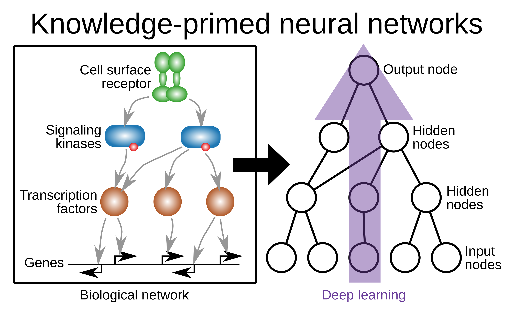
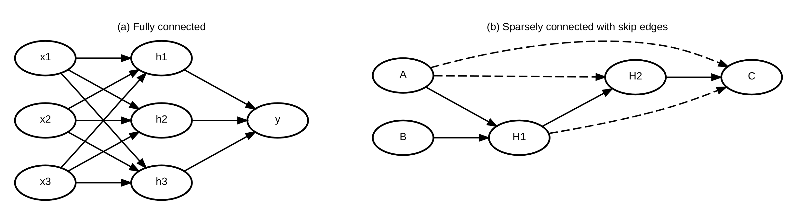

# Why kpnn2

Deep neural networks are accurate predictors but opaque ones. Their
hidden units carry no names: a unit deep inside a trained network
has no meaning outside the model, so attribution methods, which
score how much each input or unit contributes to a prediction, can
say which units matter but not what they are. For scientific use
this is a serious limitation, because a prediction can be checked against
data, but only a mechanism can be tested by experiment. One line of
work in interpretable machine learning therefore builds meaning
into the architecture itself, so that the internal units of a
network correspond to entities a scientist already knows by name.



**Figure 1.** From a biological network (left) to a knowledge-primed
neural network (right). Every node of the network is a named entity
from the prior; the arrow marks the direction of information flow.

A [knowledge-primed neural network](concepts.md#kpnn) (KPNN)
achieves this by encoding prior knowledge as a graph. Every node of
the network stands for a named entity, and an edge exists only
where the prior records a relationship between two entities.
Connections the prior does not contain are absent rather than
merely small, so sparsity, which elsewhere in deep learning serves
speed or memory, here carries the meaning of the model. Figure 1
shows the entity-based form introduced by
[Fortelny and Bock (2020)](https://doi.org/10.1186/s13059-020-02100-5).
On the left, a cell-surface receptor signals through kinases to
transcription factors, which regulate genes. On the right, the same
wiring becomes a neural network that runs against the direction of
signaling: gene expression enters at the input nodes, passes
through transcription factors and kinases in the hidden layers, and
reaches the receptor at the output node. Because each hidden node
stands for a specific protein, an attribution score on that node
says how much the trained model relies on that protein's unit,
rather than on an anonymous one.
Related models, also called visible or biologically informed neural
networks, derive the graph from pathway databases or ontologies,
such as P-NET, which is built on a hierarchy of Reactome pathways
([Elmarakeby et al., 2021](https://doi.org/10.1038/s41586-021-03922-4)).
Nothing in the construction is specific to biology: any domain whose
entities have stable names and known relationships can be modeled
the same way.

PyTorch can express such networks, but its standard components do
not. `nn.Linear` connects every unit of one layer to every unit of
the next (Figure 2a); a KPNN connects only the pairs its prior
names, and many of its edges skip layers (Figure 2b). The common
workaround multiplies each weight matrix by a fixed 0/1 mask.
Deriving those masks is a parsing problem in its own right: nodes
must be sorted into layers, edges that skip layers routed to the
correct inputs, and the column order of every layer fixed; all of
it must be redone whenever the prior changes. The more serious
difficulty is less visible. A KPNN reports its results by name, yet
inside the model a name is only an integer position, and nothing in
PyTorch checks that the two still agree. When they drift apart,
after a database update, with a feature table in a different column
order, or on reloading a checkpoint, the model still trains and the
loss looks normal, but the score reported for one gene belongs to
another. Such an error raises no exception and leaves no trace in
the metrics. Because published models have typically been
implemented with code written for one architecture, each new
project rebuilds this machinery and meets these pitfalls anew.



**Figure 2.** (a) Dense adjacent layers, the usual PyTorch case.
(b) A sparsely connected network with skip edges (dashed), the same
graph as on the [Skip edges](skip-edges.ipynb) page.

`kpnn2` resolves this by separating what the prior determines from
what the modeler decides. The prior determines which connections
exist and what each node is called, and `kpnn2` handles exactly
that part. It derives the connectivity from a named edgelist once,
keeps every node name attached to its tensor position from parsing
to attribution, and checks that correspondence wherever names and
positions meet: when the prior is parsed, when input columns are
aligned, when a checkpoint is loaded, and when attribution scores
are labeled. Everything else, including activations, normalization,
losses, the training loop, and the choice of attribution method,
stays in an ordinary PyTorch `nn.Module` that you write. The package
provides building blocks, not a finished model: there is no model
compiler and no ready-made network, so the model remains plain
PyTorch that can be read, changed, and extended like any other.

In practice, `kpnn2` provides four kinds of building blocks:

- **Parsers.** `parse_layered()` sorts an acyclic prior into layers
  and keeps each edge that skips layers in the layer it feeds.
  `parse_adjacency()` places all nodes in a single vector, which
  allows feedback loops and self-loops.
- **Sparse layers.** `PackedLinear` (one trainable weight per
  edge), `MaskedLinear` (a masked dense matrix for small graphs),
  and `PackedMultiheadAttention` (attention restricted to the
  prior's edges) take the place of `nn.Linear` and
  `nn.MultiheadAttention`.
- **Name alignment.** `align_inputs()` orders feature columns by
  name, and `map_node_attributions()` labels attribution tensors
  with node names.
- **Checks.** Malformed priors, missing input columns, checkpoints
  from a different prior, and attribution tensors of the wrong
  width raise `Kpnn2Error`; [What kpnn2 checks](#what-kpnn2-checks)
  lists each check.

## Why not custom PyTorch?

A pathway prior is still a feedforward network, so you *can*
write one in plain PyTorch: sort the named nodes into layers,
build a mask for each hop, and pass `W * mask` to `F.linear`.
Written out, that preparation is a
[parser](concepts.md#parser) — the code on the left
below is one. It also has to be rerun by hand: a single edge
added to the table can move nodes between layers, and the masks,
the layers each hop reads, and the column order of every
concatenated input all change with it.

`kpnn2` replaces that preparation with one call to
`parse_layered()` and leaves the `nn.Module` as a loop over hops.
The edgelist stays the only description of the graph, skip edges
arrive already packed into the hops that read them, and
`align_inputs()` matches input names rather than positions.
[**Skip edges**](skip-edges.ipynb) works through
the same point in a full example.

<div>

</div>

**Figure 3.** A sparse pathway prior: genes feeding transcription
factors, kinases, cellular processes and a phenotype. Solid edges
connect adjacent layers; dashed edges skip one. Both snippets
below build this network from the same edgelist.

<div class="grid code-compare" markdown>

<div markdown>

**Custom PyTorch**

```python
from collections import defaultdict, deque
import pandas as pd
import torch
import torch.nn.functional as F
from torch import nn

edgelist = pd.read_csv("pathway_prior.csv")

missing = {"source", "target"} - set(
    edgelist.columns
)
if missing:
    raise ValueError(
        f"missing columns: {sorted(missing)}"
    )
pairs = edgelist[["source", "target"]]
if pairs.isna().any().any():
    raise ValueError("missing node names")
pairs = pairs.astype(str)
if (pairs == "").any().any():
    raise ValueError("empty node names")
loop_nodes = pairs["source"][
    pairs["source"] == pairs["target"]
]
if len(loop_nodes):
    raise ValueError(
        f"self-loops: {sorted(set(loop_nodes))}"
    )
if pairs.duplicated().any():
    raise ValueError("duplicate edges")

parents = defaultdict(set)
children = defaultdict(list)
nodes = set()
for source, target in zip(
    pairs["source"],
    pairs["target"],
):
    parents[target].add(source)
    children[source].append(target)
    nodes.add(source)
    nodes.add(target)

# Kahn's algorithm: recursion would overflow
# the stack on a deep graph and never return
# on a cyclic one. What it leaves unranked
# is the cycle.
in_degree = {
    name: len(parents[name]) for name in nodes
}
ready = deque(
    name
    for name in sorted(nodes)
    if in_degree[name] == 0
)
depths = {}
while ready:
    name = ready.popleft()
    if parents[name]:
        depths[name] = 1 + max(
            depths[parent]
            for parent in parents[name]
        )
    else:
        depths[name] = 0
    for child in children[name]:
        in_degree[child] -= 1
        if in_degree[child] == 0:
            ready.append(child)
if len(depths) < len(nodes):
    unranked = sorted(nodes - depths.keys())
    raise ValueError(f"cycle: {unranked}")

by_layer = defaultdict(list)
for name, depth in depths.items():
    by_layer[depth].append(name)
layers = [
    tuple(sorted(by_layer[depth]))
    for depth in range(max(by_layer) + 1)
]
masks = []
for depth in range(1, len(layers)):
    src_layers = []
    for src_depth, layer in enumerate(
        layers[:depth]
    ):
        if any(
            source in parents[target]
            for target in layers[depth]
            for source in layer
        ):
            src_layers.append(src_depth)
    col_of = {}
    col = 0
    for src_depth in src_layers:
        for name in layers[src_depth]:
            col_of[name] = col
            col += 1
    mask = torch.zeros(
        len(layers[depth]),
        col,
    )
    for row, target in enumerate(layers[depth]):
        for source in parents[target]:
            mask[row, col_of[source]] = 1.0
    masks.append((src_layers, mask))


class Net(nn.Module):
    def __init__(self, masks, n_inputs):
        super().__init__()
        self.n_inputs = n_inputs
        self.src_layers = [
            src for src, _ in masks
        ]
        self.lins = nn.ModuleList()
        self.masks = nn.ParameterList()
        for _, mask in masks:
            self.lins.append(
                nn.Linear(
                    mask.shape[1],
                    mask.shape[0],
                )
            )
            self.masks.append(
                nn.Parameter(
                    mask,
                    requires_grad=False,
                )
            )
        self.acts = nn.ModuleList(
            [
                nn.ReLU()
                for _ in self.lins
            ]
        )

    def forward(self, x):
        # Width is checkable, column order is
        # not: ordering x to match layers[0]
        # stays the caller's job.
        if x.shape[-1] != self.n_inputs:
            raise ValueError(
                f"expected {self.n_inputs} "
                f"columns, got {x.shape[-1]}"
            )
        saved = {0: x}
        h = x
        for i, (lin, mask) in enumerate(
            zip(self.lins, self.masks)
        ):
            parts = [
                saved[src]
                for src in self.src_layers[i]
            ]
            inp = (
                parts[0]
                if len(parts) == 1
                else torch.cat(parts, 1)
            )
            h = F.linear(
                inp,
                lin.weight * mask,
                lin.bias,
            )
            if i + 1 < len(self.lins):
                h = self.acts[i](h)
            saved[i + 1] = h
        return h


model = Net(masks, len(layers[0]))
```

</div>

<div markdown>

**kpnn2**

```python
import pandas as pd
from torch import nn

import kpnn2

edgelist = pd.read_csv("pathway_prior.csv")
spec = kpnn2.parse_layered(edgelist)


class Net(nn.Module):
    def __init__(self, spec: kpnn2.LayeredSpec):
        super().__init__()
        self.spec = spec
        self.lins = nn.ModuleList(
            [
                kpnn2.PackedLinear(
                    hop.source_index,
                    hop.target_index,
                    hop.out_features,
                    hop.in_features,
                    identity=spec.fingerprint,
                )
                for hop in spec.hops
            ]
        )
        self.acts = nn.ModuleList(
            [
                nn.ReLU()
                for _ in spec.hops
            ]
        )

    def forward(self, x):
        saved = {0: x}
        h = x
        for i, (lin, hop) in enumerate(
            zip(self.lins, self.spec.hops)
        ):
            h = lin(kpnn2.gather_hop_inputs(saved, hop))
            if i + 1 < len(self.lins):
                h = self.acts[i](h)
            saved[i + 1] = h
        return h


model = Net(spec)
```

</div>

</div>

Both columns are correct. They build the same network, and both
reject the same six malformed edgelists. The left one is several
times longer, and it covers only the model: aligning input
columns, saving checkpoints, and naming
[attributions](concepts.md#attribution) still lie ahead, each
with bookkeeping of its own.

Much of that length is not the model but the checks the masks
depend on. A missing node name silently adds a node, a duplicated
edge silently collapses into one weight, and a cycle has no
layering at all, so the depth pass has to detect it rather than
recurse forever. The left column holds every check its author
thought of. The failure below is one they did not.

### A silent failure

Train the left model and save its `state_dict`. Months later, a
new database release revises one interaction in Figure 3:
`gene_n3` now regulates `tf_stat` instead of `tf_nfkb`. No node
changes layer, so every tensor keeps its shape. Rerun the left
column on the new prior and reload the checkpoint:

```python
# Before: trained on the old pathway_prior.csv
torch.save(model.state_dict(), "model.pt")

# After: the same script on the new pathway_prior.csv
model = Net(masks, len(layers[0]))
model.load_state_dict(torch.load("model.pt"))
# <All keys matched successfully>
```

The load succeeds, even with `strict=True`. The masks are
`nn.Parameter`s, so they are saved in the `state_dict`, and the
old masks overwrite the new ones. The model runs the old wiring
while every name in the script comes from the new prior. Loss and
predictions look normal. Every attribution on `gene_n3` flows
through `gene_n3 → tf_nfkb`, an edge the new prior says does not
exist.

The obvious fix moves the failure instead of removing it.
Register the masks as non-persistent buffers so they stay out of
the `state_dict`, and the load still succeeds. Now the new masks
gate weights trained under the old ones: `gene_n3 → tf_stat` runs
on a weight that never trained, and the trained
`gene_n3 → tf_nfkb` weight sits behind a zero.

With `kpnn2`, the same reload raises:

```python
model = Net(spec)  # the new pathway_prior.csv
model.load_state_dict(torch.load("model.pt"))
# Kpnn2Error: The checkpoint identity does not match this layer.
```

Each `PackedLinear` saves a digest of its packed indices and,
with `identity=spec.fingerprint`, the fingerprint of the named
prior. When either differs from the layer being loaded, loading
stops with `Kpnn2Error`.

Each failure like this one is fixable once you have seen it. The
hard part is seeing all of them in advance: this one needs a
prior update and a reload to appear, and neither column's code
hints at it. That is what `kpnn2` is for. It owns the mapping
from node names to tensor positions (layers, packed edges, input
columns, checkpoints, attribution labels), so the checks on that
mapping are written and tested once, in one place, instead of
rediscovered by every project that writes its own. It does not
check your `forward()`, your prior's biology, or your attribution
method; [**How we test**](how_we_test.md) lists what the
tests pin and what they do not prove.

## What kpnn2 checks

Each check sits where a name meets a tensor position, and each
catches a mistake that would not show up in the loss.

- **Malformed edgelists are rejected.** Both parsers reject missing
  columns, missing or empty names, and duplicate edges, which would
  otherwise collapse into one weight. `parse_layered()` also
  rejects cycles and self-loops.
- **Edges that skip layers stay in the wiring.** Such an edge is
  part of the layer it feeds, so that layer's input width includes
  it, and `gather_hop_inputs()` raises when an earlier layer it
  reads was never kept.
- **Input columns are matched by name.** `align_inputs()` finds
  each input node's column in your feature table. A reordered
  table, or one with extra columns, still lines up. A missing or
  duplicated name raises.
- **Checkpoints refuse a different prior.** Each sparse layer saves
  a digest of its wiring and, with `identity=spec.fingerprint`, the
  fingerprint of the named prior. A mismatch raises instead of
  loading; [A silent failure](#a-silent-failure) shows what the
  hand-written version does.
- **Attribution scores are labeled from the parsed graph.**
  `map_node_attributions()` names every position of a layer tensor
  and raises when the tensor's width does not match that layer.

The checks stop at that boundary. Your `forward()`, your prior's
biology, and your attribution method stay yours to get right.
[**How we test**](how_we_test.md) lists what the tests pin and
what they do not prove.

## Package philosophy

`kpnn2` is intentionally minimally opinionated.

It owns edgelist parsing, packed hop and adjacency indices, hop
input assembly, hop-output split, packed transpose, named input
alignment, and attribution column names. It does not impose
broader modeling choices such as:

- activation functions
- output heads
- dropout
- loss functions
- optimizers
- training loops

Those remain part of the normal PyTorch workflow:

- `kpnn2` turns the edgelist into structure you can execute
- PyTorch handles `forward()`, training, and customization
- you map trained tensors back to named nodes when you want
  interpretation
